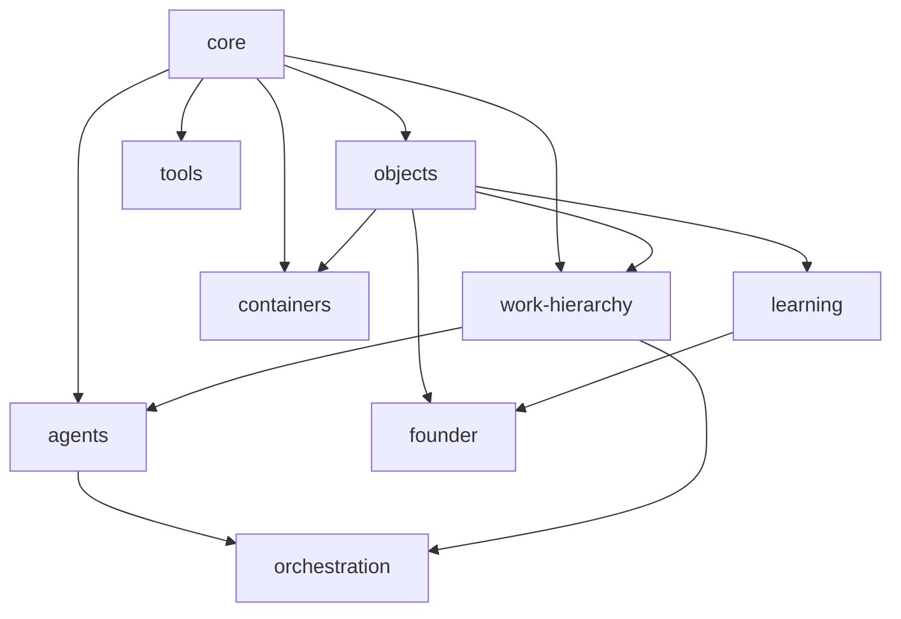

# AIOS Runtime Interfaces (Tier 3) — Component Contracts, Module Boundaries, Dependency Graph

**Status: Proposed.** Builds on `AIOS-Canonical-Object-Model.md` (Tier 1) and `AIOS-Object-Schemas.md` (Tier 2). Defines what operations exist against those schemas and which component owns each — the layer between "data shape" and "API wire format" (Tier 5).

**AI task allocation:** component boundary decisions (§1–§2) — **Claude Recommended**, since a wrong boundary here is expensive to unwind later and interacts directly with the three ADR-0002 execution loops. Individual method signatures within an already-drawn boundary (§3) — **Ollama Suitable**. Dependency graph validation (§4) — **Either**, mechanical once components are named.

---

## 1. Component boundaries (derived from ADR-0002's three loops + ADR-0001's ten layers)

Rather than inventing a component structure from scratch, this maps components onto the certified architecture's existing loop/layer boundaries — every component below has a one-to-one justification back to an accepted ADR, not a new design choice.

| Component | Owns | Governed by | Layer (ADR-0001) |
|---|---|---|---|
| **Orchestration Kernel** | Intake, dispatch, coordination of work across Agents/Departments | System Execution Loop (ADR-0002) | Runtime Coordination Kernel (5) |
| **Agent Runtime** | Agent instance lifecycle: planning → reasoning → execution → monitoring → completion | Agent Execution Loop (ADR-0002) | Organizational Departments (4) / Runtime Coordination Kernel (5) |
| **Object Store** | Canonical Object persistence, validation, mutation, synchronization, archival | Object Lifecycle Loop (ADR-0002) | Memory Engine (6) |
| **Work Hierarchy Service** | Mission/Objective/Task/Action structure and state (COM §3.4) | N/A (data service, not a loop) | Planning & Reasoning Engine (3) |
| **Container Service** | Organizational Container structure (Project, Program, etc.) | N/A (data service) | Planning & Reasoning Engine (3) |
| **Tool Abstraction Service** | Plugin/Adapter install, enable/disable, invocation routing | N/A — Plugin lifecycle only, not a full loop (COM §4.4 flags this as thin) | Tool Abstraction Layer (8) |
| **Learning Service** | Knowledge Evolution lifecycle (Session 8 finding: non-conflicting with ADR-0003, separate axis) | N/A | Learning System (7) |
| **Founder Interface** | Human Layer / Founder Intelligence cross-cutting capability (ADR-0006) — not a peer component, an access surface into the others | N/A — cross-cutting | Human Layer (1) / Executive Governance (2) |

**Note on Founder Interface:** per ADR-0006, Founder Intelligence is explicitly not a layer and not a single component — it's a capability spanning Human Layer, Executive Governance, Memory Engine, and Learning System. Modeled here as an access/interface surface that composes calls into Object Store (Memory Engine) and Learning Service rather than as an eighth peer component with its own storage — introducing separate Founder-Intelligence storage would silently reintroduce the "layer" ADR-0006 explicitly rejected.

---

## 2. Service contracts (one per component, method signatures only — full API wire format is Tier 5)

### 2.1 Orchestration Kernel

```typescript
interface OrchestrationKernel {
  dispatch(workflow: Workflow): Promise<WorkflowRunHandle>;
  intake(request: WorkIntakeRequest): Promise<Task | Workflow>;
  coordinate(agents: string[], task: Task): Promise<void>; // multi-agent coordination on one Task
  status(handle: WorkflowRunHandle): Promise<LifecycleState>;
}
```

### 2.2 Agent Runtime

```typescript
interface AgentRuntime {
  instantiate(spec: AgentSpec): Promise<Agent>;              // -> lifecycle_state: created
  validate(agentId: string): Promise<ValidationResult>;      // -> validated
  activate(agentId: string, task: Task): Promise<void>;      // -> active, substate: planning
  step(agentId: string): Promise<AgentSubstate>;             // advances planning->reasoning->executing->monitoring
  suspend(agentId: string): Promise<void>;
  complete(agentId: string): Promise<void>;
  archive(agentId: string): Promise<void>;
}
```

### 2.3 Object Store

```typescript
interface ObjectStore {
  create<T extends CanonicalObject>(obj: Omit<T, "entity_id" | "lifecycle_history">): Promise<T>;
  validate(entityId: string): Promise<ValidationResult>;
  mutate<T extends CanonicalObject>(entityId: string, patch: Partial<T>): Promise<T>; // rejected if MemoryObject + completed, see Tier 2 §3.4
  get(entityId: string): Promise<CanonicalObject | null>;
  query(filter: ObjectQuery): Promise<CanonicalObject[]>;
  archive(entityId: string): Promise<void>;
  relate(fromId: string, rel: Relationship): Promise<void>; // COM §8
}
```

### 2.4 Work Hierarchy Service

```typescript
interface WorkHierarchyService {
  createMission(spec: MissionSpec): Promise<string>; // returns entity_id; Mission is a hierarchy scoping container per ADR-0004, not a CanonicalEntity in this model — see COM §2
  assignObjective(objectiveId: string, missionId: string): Promise<void>; // "assigned to", not "translated into" — ADR-0004 Amendment A
  createTask(objectiveId: string, spec: TaskSpec): Promise<Task>;
  decomposeIntoActions(taskId: string, actions: Omit<Action, "action_id">[]): Promise<Task>;
}
```

### 2.5 Container Service

```typescript
interface ContainerService {
  createContainer(type: OrganizationalContainerType, spec: ContainerSpec): Promise<string>;
  assignToContainer(entityId: string, containerId: string, type: OrganizationalContainerType): Promise<void>;
  nestContainer(childId: string, parentId: string): Promise<void>; // e.g. Project inside Program — container nesting, not Work Hierarchy nesting (ADR-0004 Amendment A)
}
```

### 2.6 Tool Abstraction Service

```typescript
interface ToolAbstractionService {
  install(plugin: Omit<Plugin, "entity_id" | "lifecycle_history">): Promise<Plugin>;
  enable(pluginId: string): Promise<void>;
  disable(pluginId: string): Promise<void>;
  invoke(pluginId: string, operation: string, args: unknown): Promise<unknown>; // DEFERRED — not implemented, not deleted. See below.
}
```

**`invoke()` is DEFERRED (founder decision, 2026-07-13) — deliberately unimplemented, and deliberately still in the contract.** It must resolve a plugin id to executable code, and nothing in the certified corpus can do that: `Plugin.wraps_adapter` (COM §4.4) points at an **Adapter** concept with no schema, no store, and no registry anywhere in the model. Implementing it therefore requires *inventing* a Plugin/Adapter execution model — an architectural decision, on top of the lowest-confidence entity in the corpus (COM §4.4, AGENTS.md rule 7).

`@aios/tools` accordingly ships `install` / `enable` / `disable` — the part of this contract that is fully specified and invents nothing — and leaves the gap visible.

**Reopening trigger: the first real adapter integration.** That adapter is the one real implementation this contract must be validated against before it is written, per AGENTS.md rule 7. Until then this method is a stated requirement with no ratified means of satisfying it, which is a different thing from a mistake — it is not to be deleted, and it is not to be filled in speculatively.

Full reasoning, and what the decision explicitly does *not* settle: `docs/process/invoke-adapter-deferral.md`.

**Deferral settles the execution model only — this signature's *shape* is a separate open question.** `invoke(pluginId, operation, args)` is pluginId-centric, while ratified Part XIII Ch.3/7/9 specifies capability-mediated tool selection ("Departments request capabilities from the registry rather than selecting tools directly"). Whether that contradiction is a rule-1 ADR trigger has not been evaluated. Tracked as `docs/process/divergence-log.md` **unresolved architectural conflict #4**; gated on the `@aios/orchestration` / `@aios/founder` evidence-gathering pass, and not to be resolved speculatively before it.

### 2.7 Learning Service

```typescript
interface LearningService {
  recordObservation(subject: string, content: unknown): Promise<string>;
  promote(observationId: string, toStage: "candidate" | "validated" | "published" | "institutional_standard"): Promise<void>;
  archiveKnowledge(id: string): Promise<void>; // "historical archive" stage, per Session 8 finding — distinct axis from CanonicalEntity.lifecycle_state
}
```

### 2.8 Founder Interface

```typescript
interface FounderInterface {
  query(question: string): Promise<FounderResponse>; // composes ObjectStore + LearningService reads
  recordDecision(decision: FounderDecisionRecord): Promise<string>; // writes an Artifact (entity_subtype: "adr" or similar) via ObjectStore
  reviewQueue(): Promise<CanonicalEntity[]>; // entities with access_policy or owner_id flags requiring human review
}
```

---

## 3. Module boundaries and package responsibilities

**Ollama Suitable** once §1–§2 are fixed — this is a mechanical grouping exercise.

```
aios/
├── core/                    # CanonicalEntity base types, shared across everything (Tier 1/2 output lives here)
├── orchestration/           # Orchestration Kernel — depends on: core, agents, work-hierarchy
├── agents/                  # Agent Runtime — depends on: core, work-hierarchy
├── objects/                 # Object Store — depends on: core only
├── work-hierarchy/          # Work Hierarchy Service — depends on: core, objects
│                             #   — NOTE (corrected 2026-07-10, senior architecture review): this dependency edge
│                             #   is structural (§4's graph) and holds regardless of how the Task/Object storage
│                             #   boundary resolves. It is NOT an assertion that Tasks are stored via Object Store —
│                             #   that would silently pre-decide §5's open question as Option A. This document's
│                             #   own working assumption is Option B (Task has its own backing store, separate
│                             #   from Object Store). See §5 for the actual open question and its resolution status.
├── containers/               # Container Service — depends on: core, objects
│                             #   — NOTE (corrected 2026-07-13): the objects edge was added by ADR-0011,
│                             #   which makes Project a Canonical Object subtype (COM §5.4) stored via
│                             #   ObjectStore<ProjectEntity>. This graph originally said "core" only, drawn
│                             #   when NO container type had a schema or a store. Project is still the only
│                             #   implemented container type — the other eight have no field-level spec in
│                             #   the corpus, so ContainerService (§2.5) remains unimplementable. See §5.
├── tools/                    # Tool Abstraction Service — depends on: core
├── learning/                  # Learning Service — depends on: core, objects
└── founder/                   # Founder Interface — depends on: objects, learning (never depended ON by others, per ADR-0006 cross-cutting, not foundational)
```

**Rule enforced by this structure:** no package below `core/` may be depended on by `core/` — this is the acyclic constraint that makes the dependency graph (§4) a DAG rather than requiring a circular-dependency resolution strategy nobody has designed.

---

## 4. Dependency graph



Build order implied by this graph (topological sort — full detail in Tier 7): `core` → `objects` → (`work-hierarchy`, `containers`, `tools`, `learning`) → `agents` → `orchestration` → `founder`.

---

## 5. Open item surfaced by this tier (flagged, not resolved)

**Whether Task/Mission/Objective are stored via the Object Store or via a dedicated Work Hierarchy Service backing store is genuinely ambiguous in the certified architecture**, and this document is not resolving it unilaterally because it's closer to an architectural decision than a mechanical one:

- **Option A:** Tasks are Canonical Objects (`entity_type: "canonical_object"`, some new `entity_subtype`) and Work Hierarchy Service is a thin query/business-logic layer over Object Store. Simpler, one storage system, but stretches "Canonical Object" to cover execution-hierarchy entities when ADR-0003 lists Task as its own peer entity type, not a Canonical Object subtype.
- **Option B:** Task is its own `entity_type` (as modeled in Tier 1/2, consistent with ADR-0003's literal five-type list) with its own backing store separate from Object Store, and Work Hierarchy Service owns that store directly. More faithful to ADR-0003's exact wording, more storage systems to build.

This document (and Tier 1/2) assumed **Option B** throughout, since it's the more literal reading of ADR-0003's entity list — flagged here explicitly so it's visible as an assumption rather than buried. If a future implementation pass finds Option A cheaper and Option B's extra storage system isn't earning its cost, that's exactly the kind of "implementation reveals friction against the schema" situation flagged as likely in this session's opening pushback — not a certification error, an expected refinement.
