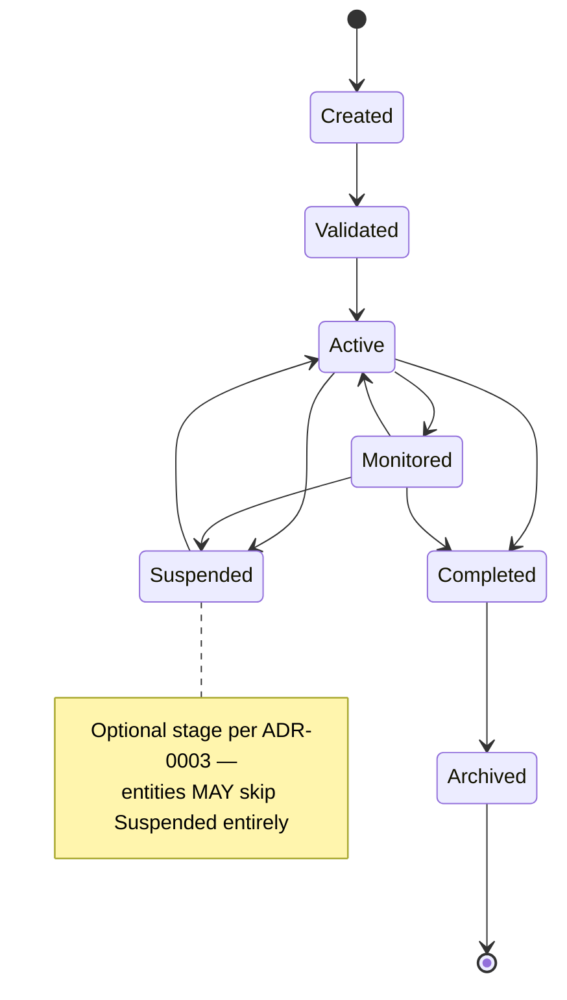
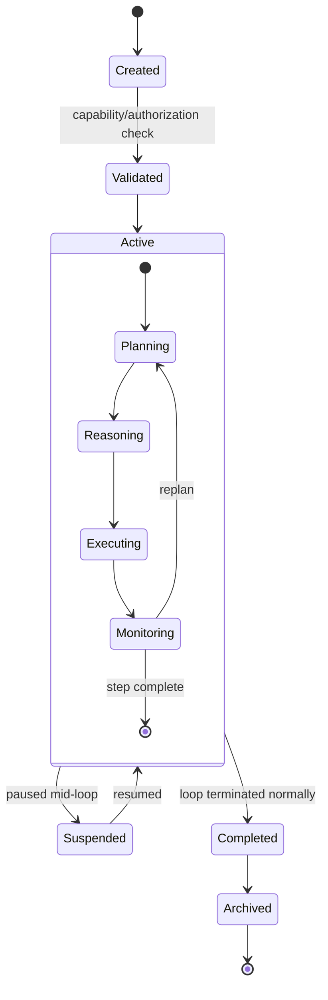
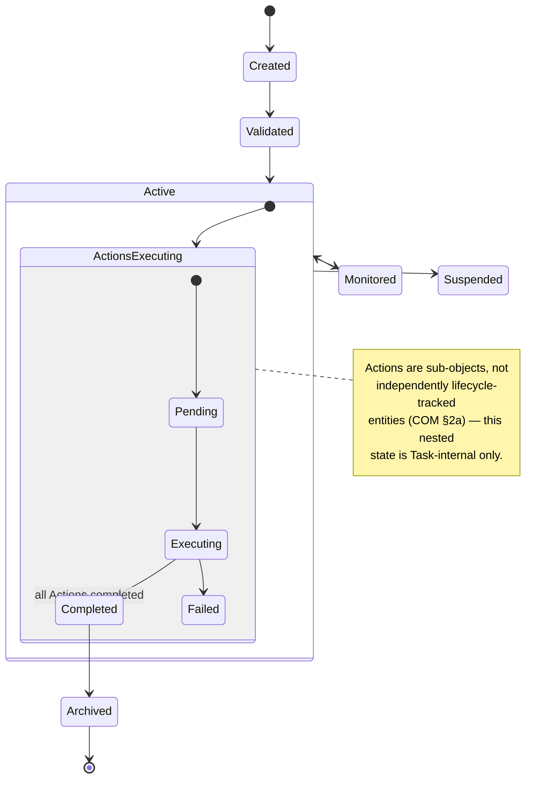
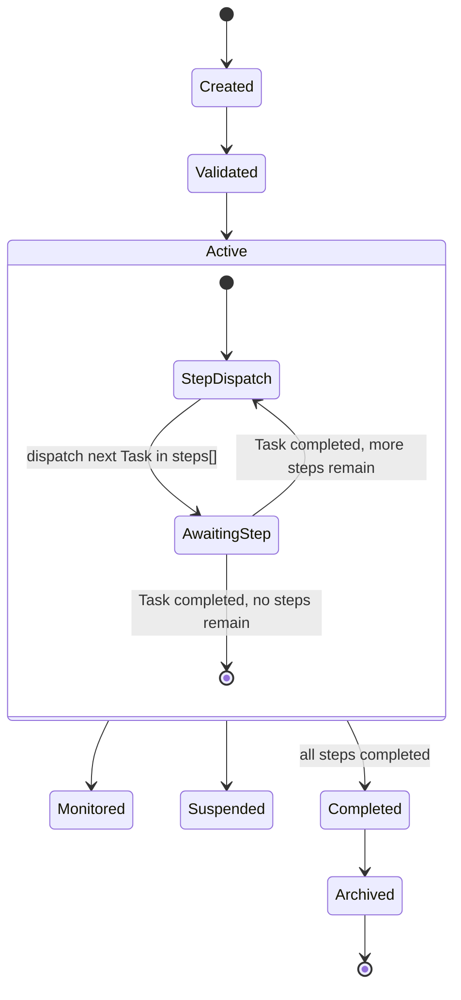
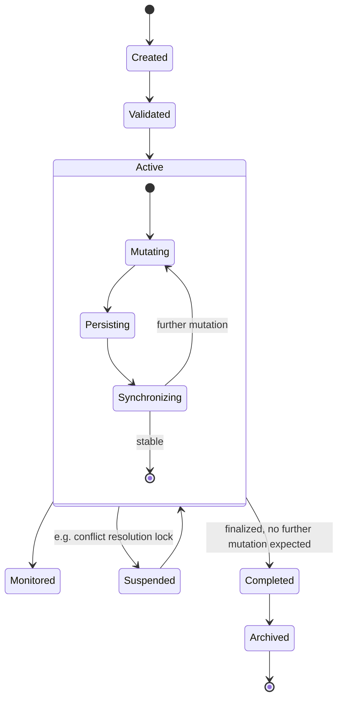
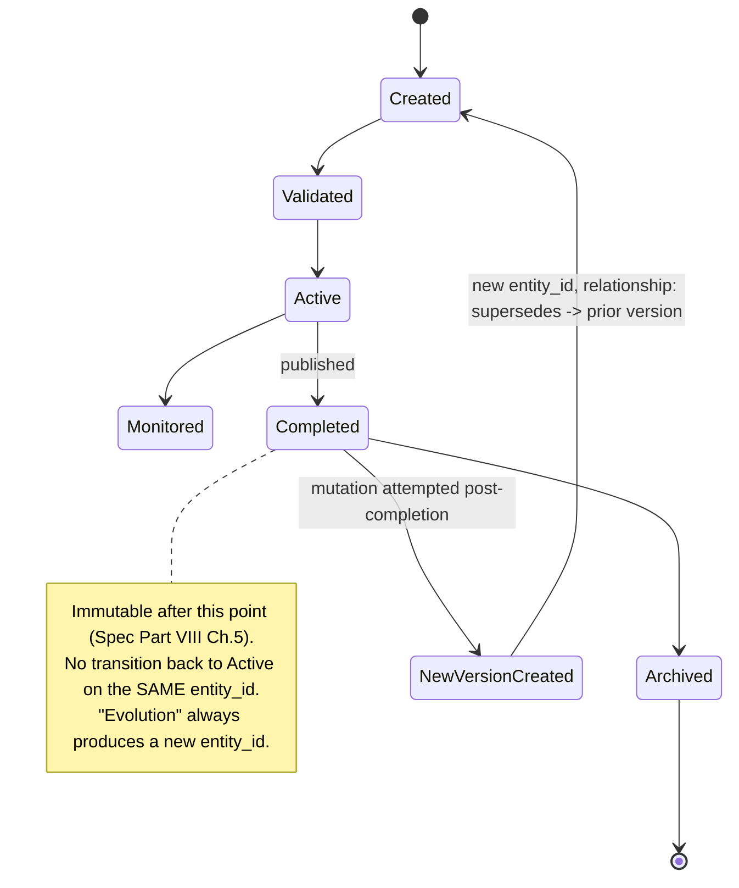
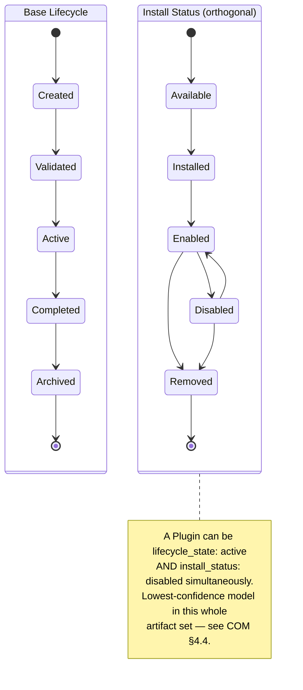
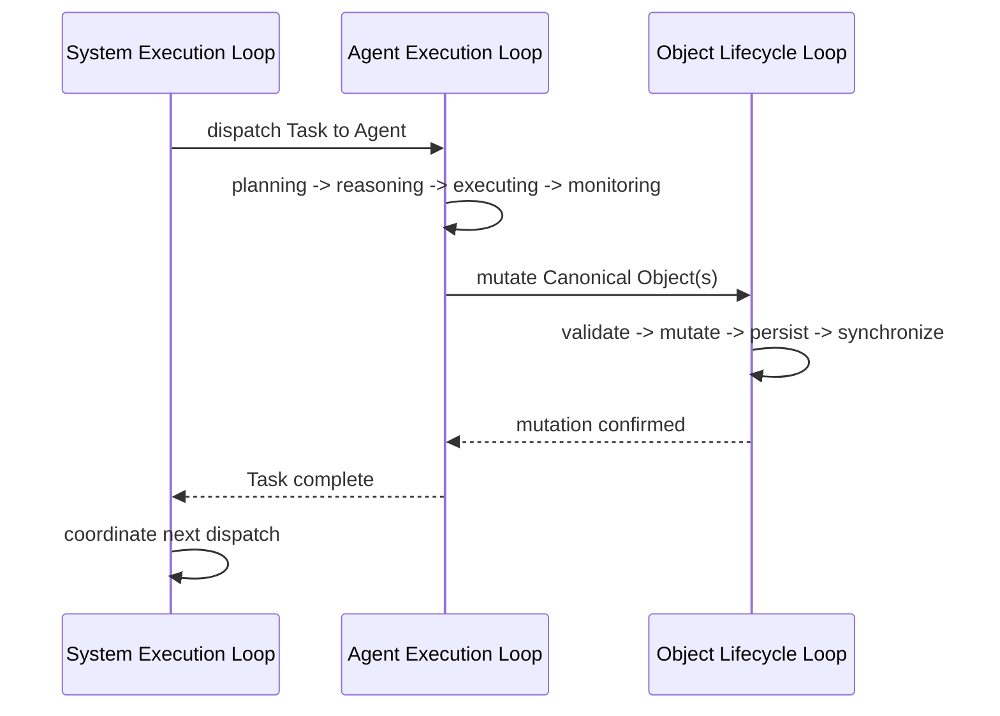

# AIOS State Machines (Tier 4) — Lifecycle Diagrams

**Status: Proposed.** Renders `AIOS-Canonical-Object-Model.md` §4's lifecycle-substate tables as formal Mermaid state diagrams. Every transition below is sourced from a table already in the COM or an ADR — no new states are introduced here.

**AI task allocation: Ollama Suitable.** Mechanical rendering of already-fixed tables into diagram syntax; low architectural risk.

---

## 1. Canonical base lifecycle (all five entity types, ADR-0003)

---

## 2. Agent lifecycle (Agent Execution Loop, ADR-0002, substates per COM §4.1)

---

## 3. Task lifecycle (base lifecycle + Action sub-execution, COM §4.2)

---

## 4. Workflow lifecycle (System Execution Loop, ADR-0002, steps = ordered Tasks)

---

## 5. Canonical Object lifecycle (Object Lifecycle Loop, ADR-0002, substates per COM §4.5)

---

## 6. Memory Object lifecycle (Canonical Object specialization, immutability rule per COM §5.1)

---

## 7. Plugin lifecycle (install status is orthogonal to base lifecycle, COM §4.4)

---

## 8. Three-loop relationship (ADR-0002, system view)

